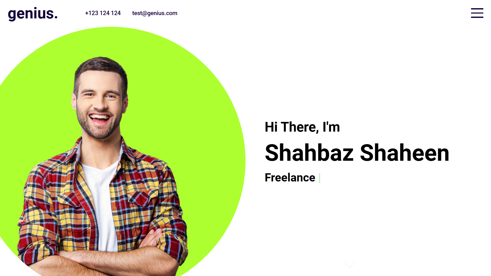

# 💼 React Portfolio Website

## Overview

This is a customizable portfolio template built using React. It’s designed to help developers and designers create a professional online presence by showcasing their work, skills, and experience.

## 🔗 Project URL

Check out the live version of the project here: [React-Portfolio](https://genius-react-portfolio.netlify.app/)

## 🖼️ Screenshots

## 🛠️ Technologies Used

- **React:** A JavaScript library for building user interfaces.
- **Styled Components/SCSS Modules:** For styling the application in a modular and maintainable way.

## ✨ Features

- **Modern Design:** A clean and responsive design that looks great on all devices.
- **Customizable Sections:** Easily add or remove sections like About, Projects, Skills, and Contact.
- **Responsive Layout:** Works seamlessly across desktop, tablet, and mobile devices.
- **Smooth Animations:** Subtle animations for a dynamic user experience.

## 🚀 Getting Started

To run this project locally, follow these steps:

1. Clone the repository: `git clone https://github.com/Developer-Bilal/react-portfolio-website.git`
2. Navigate to the project directory: `cd react-portfolio-website`
3. npm install
4. npm start

The application should now be running on http://localhost:3000.

## 📧 Contact

If you have any questions or suggestions, feel free to reach out:

- Email: bilalchanna67@gmail.com ✉️
- LinkedIn: [Profile](https://www.linkedin.com/in/Engineer-Bilal-Channa) 💼
